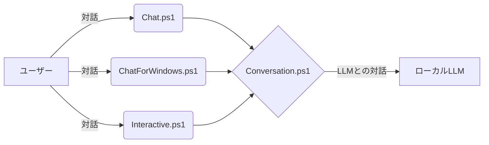
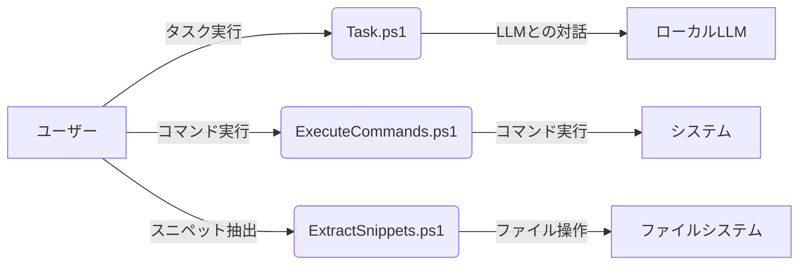

# src_genai_Script_to_use_local_LLM_with_llama.cpp_and_PowerShell
ローカルLLMをllama.cppとPowerShellで利用するスクリプト

PowerShellスクリプトを使用して、ローカル環境で大規模言語モデル（LLM）と対話したり、タスクを実行したりするためのツール集です。

<br/><br/>
### 目次

- [概要](#概要)
- [本スクリプト集の主な機能](#本スクリプト集の主な機能)
    - [1. ローカルLLMとの対話](#1-ローカルllmとの対話)
    - [2. タスクの実行](#2-タスクの実行)
- [前提条件・環境設定](#前提条件環境設定)
- [基本的な使い方](#基本的な使い方)
    - [Chat.ps1 の基本的な使い方](#chatps1-の基本的な使い方)
    - [ChatForWindows.ps1 の基本的な使い方](#chatforwindowsps1-の基本的な使い方)
    - [Task.ps1 の基本的な使い方](#taskps1-の基本的な使い方)
    - [Interactive.ps1 の基本的な使い方](#interactiveps1-の基本的な使い方)
- [設定ファイル (`configure.json`) の詳細](#設定ファイル-configurejson-の詳細)
- [プロンプトファイルと出力について](#プロンプトファイルと出力について)
- [スクリプト呼び出し関係図](#スクリプト呼び出し関係図)
- [補足](#補足)

<br/><br/>


### 概要

これは、PowerShellスクリプトを使用して、ローカル環境で大規模言語モデル（LLM）と対話したり、タスクを実行したりするためのツール集です。
このスクリプト集は、`llama.cpp` を活用してローカルマシン上でLLM（現時点では Phi-3 mini を想定）を動作させることを前提としています。
LLMのローカル環境構築については、こちらのガイド（[github.com/SparklingDetergent/doc_genai_Run_local_LLM_with_Llama.cpp_and_Phi-3_mini](https://github.com/SparklingDetergent/doc_genai_Run_local_LLM_with_Llama.cpp_and_Phi-3_mini/blob/main/README.md)）をご参照ください。

スクリプトの動作は、設定ファイル `configure.json` によって制御され、APIエンドポイントやプロンプトのフォーマットなどを柔軟にカスタマイズできます。

```mermaid
graph LR
    A[PowerShellスクリプト集] -- llama.cpp を利用 --> B[ローカルLLM (例: Phi-3 mini)]
    A -- 設定ファイル(configure.json) で制御 --> B
    A -- 対話とタスク実行 --> ユーザー
```

<br/><br/>


### 本スクリプト集の主な機能

このツール集は、主に以下の二つの機能を提供します。

#### 1. ローカルLLMとの対話

ユーザーがローカルLLMと対話形式でコミュニケーションを取るためのスクリプト群です。

- **Chat.ps1**: 会話履歴を管理し、継続的な対話セッションを実現します。ユーザーは自然な流れでLLMとの会話を続けることができます。
- **ChatForWindows.ps1**: `Chat.ps1` の機能をWindows GUI環境で提供し、より直感的な操作を可能にします。
- **Interactive.ps1**: 1回限りの質問や簡単なタスク実行に適した対話型インターフェースを提供します。
- **Conversation.ps1**: システムプロンプト、ユーザー入力、およびアシスタントからの応答という、対話の基本的な1ターンを処理するコアスクリプトです。他の対話スクリプトから利用されます。



<br/><br/>


#### 2. タスクの実行

特定のタスクをLLMに実行させるためのスクリプト群です。

- **Task.ps1**: 事前に定義されたプロンプトファイルを読み込み、LLMに処理を実行させ、結果を出力ファイルに保存します。バッチ処理や定型的なタスクの自動化に適しています。
- **ExecuteCommands.ps1**: テキストファイル内に記述された一連のコマンドを抽出し、順次実行します。LLMが生成したコマンドの実行などに活用できます。
- **ExtractSnippets.ps1**: 指定されたファイルから特定のパターンに一致するコードスニペット（例：マークダウンファイル内のコードブロック）を抽出し、個別のファイルとして保存します。ドキュメントからのコード抽出などに便利です。



<br/><br/>


### 前提条件・環境設定

本スクリプト集を利用するためには、以下の前提条件と環境設定が必要です。

#### 1. 必要なソフトウェア

*   **PowerShell**: スクリプトの実行に必要です。最新バージョンの利用を推奨します。Windowsに標準搭載されていますが、LinuxやmacOSにもインストール可能です。
*   **llama.cpp**: ローカルでLLMを動作させるためのコアコンポーネントです。ご自身でコンパイルするか、提供されている実行可能ファイルを入手する必要があります。
    *   詳細は [llama.cppの公式リポジトリ](https://github.com/ggerganov/llama.cpp) を参照してください。
*   **LLMモデルファイル**: `llama.cpp`と互換性のあるモデルファイル（例: GGUF形式）が必要です。
    *   例として、Microsoftの `Phi-3-mini-4k-instruct` モデルなどがあります。モデルファイルは別途ダウンロードまたは変換して準備してください。

#### 2. llama.cpp サーバーの起動

PowerShellスクリプトがLLMと通信するためには、`llama.cpp` のサーバー機能がバックグラウンドで実行されている必要があります。

*   サーバーの起動コマンドの例（モデルパスやパラメータは適宜変更してください）:
    ```bash
    ./server -m models/phi-3-mini-4k-instruct-q4g.gguf -c 2048 --port 8088 --host 0.0.0.0
    ```
    *   `-m models/phi-3-mini-4k-instruct-q4g.gguf`: 使用するモデルファイルのパスを指定します。
    *   `-c 2048`: コンテキストサイズを指定します。モデルの能力に合わせて調整してください。
    *   `--port 8088`: サーバーがリッスンするポート番号を指定します。
    *   `--host 0.0.0.0`: すべてのネットワークインターフェースからの接続を許可する場合に指定します。セキュリティに応じて変更してください。

*   **重要**: サーバーを起動する際のホスト名（またはIPアドレス）とポート番号を記録しておいてください。

#### 3. 設定ファイル (`configure.json`)

*   スクリプト集のルートディレクトリにある `configure.json` ファイルを編集し、LLMサーバーへの接続情報や動作パラメータを設定します。
*   特に、`Uri` キーの値を、上記ステップで起動した `llama.cpp` サーバーのアドレス（例: `"http://localhost:8088/completion"` や `"http://<サーバーのIPアドレス>:8088/completion"`）に正しく設定する必要があります。
    ```json
    {
      "n_predict": 2048,
      "Uri": "http://localhost:8088/completion",
      "ContentType": "application/json",
      "system_s": "<|system|>",
      "system_e": "<|end|>",
      "user_s": "<|user|>",
      "user_e": "<|end|>",
      "assistant_s": "<|assistant|>",
      "assistant_e": "<|end|>"
    }
    ```
*   `configure.json` の詳細については、「設定ファイル (configure.json)」のセクションを参照してください。

#### 4. 詳細な環境構築ガイド

`llama.cpp` の導入や特定のLLMモデル（例: Phi-3 mini）のセットアップに関する包括的な手順については、以下の外部ドキュメントも併せてご参照ください。

*   [github.com/SparklingDetergent/doc_genai_Run_local_LLM_with_Llama.cpp_and_Phi-3_mini](https://github.com/SparklingDetergent/doc_genai_Run_local_LLM_with_Llama.cpp_and_Phi-3_mini/blob/main/README.md)

<br/><br/>


### スクリプト呼び出し関係図

```mermaid
graph LR
    A[Chat.ps1] --> B(ChatFunction.ps1)
    Z[Task.ps1] --> C(TaskFunction.ps1)
    CONV[Conversation.ps1] --> F(ConversationFunction.ps1)
    INT[Interactive.ps1] --> IFUNC(InteractiveFunction.ps1)
    EXEC[ExecuteCommands.ps1] --> EFUNC(ExecuteCommandsFunction.ps1)
    EXTR[ExtractSnippets.ps1] --> XFUNC(ExtractSnippetsFunction.ps1)

    B --> C TaskFunction.ps1 を利用
    B --> D(ProcessOutputPathFunction.ps1)
    B --> E(WriteParametersFunction.ps1)

    C --> F
    C --> E
    C --> D

    IFUNC --> F
    IFUNC --> E

    EFUNC --> E
    EFUNC --> D

    XFUNC --> E
    XFUNC --> D

    F --> G(InferenceFunction.ps1)
    F --> H(RemoveSpecifiedStringsFunction.ps1)

    G --> E
    D --> E
```


<br/><br/>


### 設定ファイル (`configure.json`) の詳細

本スクリプト集の動作は、ルートディレクトリに配置される `configure.json` ファイルによって詳細に制御されます。このファイルはJSON形式で記述され、スクリプト実行前に適切に設定しておく必要があります。

以下に主要な設定項目を示します。

*   `dummy`: JSONファイルが空でないことを保証するためのダミーエントリ、またはコメントとしての役割を持つ場合があります。通常は `true` が設定されます。
*   `chatName`: `ChatForWindows.ps1` を使用する際のウィンドウタイトルに表示される名前です。
    *   例: `"Phi-3 mini Chat"`
*   `minimizeAndWait`: `ChatForWindows.ps1` でメッセージ送信後にウィンドウを最小化し、応答があるまで待機するかどうかを制御する真偽値 (`true` または `false`)。
*   `before_and_after_user_prompts_only_for_the_first_time`: `Chat.ps1` などで `beforeUserPrompt.conf` や `afterUserPrompt.conf` ファイルを使用する場合に、これらのプロンプトを会話の最初のターンのみに適用するか (`true`)、毎回のユーザー入力に適用するか (`false`) を制御します。
*   `n_predict`: LLMが生成するトークンの最大数。`llama.cpp` サーバーの標準パラメータに対応します。
    *   例: `2048`
*   `cache_prompt`: プロンプトをキャッシュするかどうかの真偽値 (`true` または `false`)。`llama.cpp` サーバーの標準パラメータに対応し、共通のプロンプト接頭辞の処理を高速化できる場合があります。
*   `stream`: LLMからの応答をストリーミング形式で受信し、逐次表示するかどうかの真偽値 (`true` または `false`)。
*   `Uri`: `llama.cpp` サーバーのAPIエンドポイントの完全なURI。
    *   例: `"http://127.0.0.1:8088/completion"`
*   `ContentType`: `llama.cpp` サーバーへのリクエスト時のコンテントタイプ。通常は `application/json` または `application/json; charset=utf-8` を指定します。
    *   例: `"application/json; charset=utf-8"`
*   `system_s`, `system_e`: システムプロンプトの開始と終了を示すマーカー文字列。LLMに送信する最終的なプロンプトの組み立てに使用されます。**この値は使用するLLMのフォーマットに厳密に合わせる必要があります。**
    *   例（Phi-3の場合）: `system_s: "<|system|>", system_e: "<|end|>"`
*   `user_s`, `user_e`: ユーザープロンプトの開始と終了を示すマーカー文字列。同様にLLMのフォーマットに合わせる必要があります。
    *   例（Phi-3の場合）: `user_s: "<|user|>", user_e: "<|end|>"`
*   `assistant_s`, `assistant_e`: アシスタント（LLM）の応答の開始と終了を示すマーカー文字列。これもLLMのフォーマットに合わせる必要があります。
    *   例（Phi-3の場合）: `assistant_s: "<|assistant|>", assistant_e: "<|end|>"`
*   `responseFileName`: LLMからの生の応答全体を保存する際のデフォルトファイル名。
    *   例: `"response.json"`
*   `userPromptFileName`: ユーザーが入力したプロンプト部分を保存する際のデフォルトファイル名。
    *   例: `"userPrompt.txt"`
*   `promptFileName`: LLMに実際に送信された完全なプロンプト（システムプロンプト、履歴、ユーザープロンプト等を含む）を保存する際のデフォルトファイル名。
    *   例: `"prompt.txt"`
*   `contentFileName`: LLMの応答から抽出された主要なテキスト内容を保存する際のデフォルトファイル名。
    *   例: `"content.txt"`
*   `stoppingWordFileName`: セッションで使用されるストップワードを保存する際のデフォルトファイル名。
    *   例: `"stopping_word.txt"`

**プロンプトマーカーに関する重要な注意:**
`system_s`, `system_e`, `user_s`, `user_e`, `assistant_s`, `assistant_e` の各マーカーは、使用するLLMモデルが期待する特定のフォーマットに正確に一致している必要があります。モデルのドキュメントやHugging Faceなどのリポジトリで提供されているプロンプト形式の指示に従ってください。これらのマーカーが正しくないと、LLMが期待通りに動作しない可能性があります。

**`configure.json` の記述例:**

```json
{
  "dummy": true,
  "chatName": "My Local LLM Chat",
  "minimizeAndWait": false,
  "before_and_after_user_prompts_only_for_the_first_time": true,
  "n_predict": 2048,
  "cache_prompt": true,
  "stream": true,
  "Uri": "http://127.0.0.1:8088/completion",
  "ContentType": "application/json; charset=utf-8",
  "system_s": "<|system|>",
  "system_e": "<|end|>",
  "user_s": "<|user|>",
  "user_e": "<|end|>",
  "assistant_s": "<|assistant|>",
  "assistant_e": "<|end|>",
  "responseFileName": "response.json",
  "userPromptFileName": "userPrompt.txt",
  "promptFileName": "prompt.txt",
  "contentFileName": "content.txt",
  "stoppingWordFileName": "stopping_word.txt"
}
```

<br/><br/>


### プロンプトファイルと出力について

このセクションでは、スクリプトで使用される主要な外部ファイル（主にプロンプト設定ファイル）と、スクリプトが生成する主な出力ファイルについて説明します。

#### プロンプト設定ファイル (`.conf` ファイル)

これらの `.conf` ファイルは、LLMへの指示内容を外部から与えるために使用されます。特に指定がない限り、これらのファイルはプレーンテキスト形式です。

*   **`systemPrompt.conf`**:
    *   **目的**: LLMの役割、振る舞い、応答スタイルなどを定義するシステムレベルの指示を含みます。
    *   **使用スクリプト/パラメータ**: `Chat.ps1`, `ChatForWindows.ps1`, `Task.ps1` などで `-systemPromptPath` パラメータを通じて指定されます。
*   **`userPrompt.conf`**:
    *   **目的**: `Task.ps1` で実行させたい具体的なタスクや質問を記述します。
    *   **使用スクリプト/パラメータ**: 主に `Task.ps1` で `-userPromptPath` パラメータを通じて指定されます。
*   **`assistantPrompt.conf`**:
    *   **目的**: LLMの応答のトーンを調整したり、特定の応答形式を促したり、フューショット（few-shot）の例を提供したりするために使用されます。
    *   **使用スクリプト/パラメータ**: `Chat.ps1`, `Task.ps1` などで `-assistantPromptPath` パラメータを通じて指定されます。
*   **`beforeUserPrompt.conf`**:
    *   **目的**: ユーザーが入力するプロンプトの直前に挿入されるテキストです。例えば、定型的な指示や追加のコンテキストを付与する場合に使用します。
    *   **使用スクリプト/パラメータ**: `Chat.ps1` などで `-beforeUserPromptPath` パラメータを通じて指定されます。適用タイミングは `configure.json` の `before_and_after_user_prompts_only_for_the_first_time` 設定に依存します。
*   **`afterUserPrompt.conf`**:
    *   **目的**: ユーザーが入力するプロンプトの直後に挿入されるテキストです。役割は `beforeUserPrompt.conf` と同様です。
    *   **使用スクリプト/パラメータ**: `Chat.ps1` などで `-afterUserPromptPath` パラメータを通じて指定されます。適用タイミングは `beforeUserPrompt.conf` と同じです。
*   **`defaultUserPrompt.conf`**:
    *   **目的**: `Chat.ps1` (特に `ChatForWindows.ps1` での利用が考えられます) で、ユーザーが明示的に何も入力しなかった場合や、セッション開始時の最初のメッセージとして使用されるデフォルトのユーザープロンプトです。
    *   **使用スクリプト/パラメータ**: `Chat.ps1` などで `-defaultUserPromptPath` パラメータを通じて指定されます。
*   **`stopWord.conf`**:
    *   **目的**: LLMが特定の単語やフレーズを生成した場合に、そこで応答の生成を停止させるためのストップワードをリスト形式で記述します（1行に1つ）。これらのストップワードは `llama.cpp` サーバーに送信され、サーバー側で処理されます。
    *   **使用スクリプト/パラメータ**: `Chat.ps1` などで `-stopWordPath` パラメータを通じて指定されます。

#### 主な出力ファイル

スクリプトは実行時に、指定された `-outputPath` ディレクトリ（またはスクリプトのデフォルト設定に基づく場所）に以下のようなログファイルや結果ファイルを生成します。ファイル名は `configure.json` で一部カスタマイズ可能です。

*   **`prompt.txt`** (`promptFileName` で設定可): LLMに送信された最終的なプロンプト全体（システムプロンプト、会話履歴、ユーザープロンプト、アシスタントプロンプトマーカーなど全てを含む）が保存されます。デバッグやプロンプトエンジニアリングに役立ちます。
*   **`content.txt`** (`contentFileName` で設定可): LLMの応答から抽出された主要なテキスト内容。通常、ユーザーが最も関心のあるLLMの返答部分です。
*   **`response.json`** (`responseFileName` で設定可): `llama.cpp` サーバーから返された生のJSON形式の応答全体。これには `content.txt` 以外のメタデータや統計情報も含まれることがあります。
*   **`stopping_word.txt`** (`stoppingWordFileName` で設定可): そのセッションで使用されたストップワードのリスト。
*   **`userPrompt.txt`** (`userPromptFileName` で設定可): ユーザーが入力した部分のプロンプトのみを保存する場合に使用されます。
*   **`ChatBox_<タイムスタンプ>.txt`**: `ChatForWindows.ps1` を使用した際のチャットログ。GUIでの会話内容が時系列で記録されます。

#### 文字エンコーディングに関する注意

プロンプトファイル (`.conf`) やその他のテキストベースの入力ファイルを作成・編集する際には、文字エンコーディングに注意が必要です。

*   **推奨エンコーディング**: **UTF-8 (BOM無し)** を強く推奨します。UTF-8は多くのシステムやアプリケーションで標準的にサポートされており、特に `llama.cpp` のようなC++ベースのツールとの連携において互換性が高いです。
*   **潜在的な問題**: このリポジトリ内の一部のスクリプトファイル (`.ps1`) や設定ファイル (`configure.json`) が UTF-16LE (BOM付き) で保存されている場合が見受けられます。もし `.conf` ファイルをUTF-8で作成して問題が発生する場合（例: 文字化け、スクリプトがファイルを正しく読み込めないなど）、代替案としてUTF-16LE (BOM付き) での保存を試すことも考えられます。しかし、基本的にはUTF-8での統一を目指すのが望ましいです。

問題が発生した場合は、まずファイルのエンコーディングを確認し、必要に応じてテキストエディタで変換してください。

<br/><br/>


### 基本的な使い方

このセクションでは、主要なスクリプトの基本的な使い方について説明します。
各スクリプトを実行する際は、PowerShellの実行ポリシーやプロファイル設定にご注意ください。多くの場合、以下のようなプレフィックスで実行できます。

Windows PowerShellの場合:
```powershell
powershell -NoProfile -ExecutionPolicy Bypass -Command "$VerbosePreference='Continue';$ErrorActionPreference='Stop';" # この後にスクリプト呼び出しを続ける
```

Windows pwsh (PowerShell Core) の場合:
```powershell
pwsh -NoProfile -ExecutionPolicy Bypass -Command "$VerbosePreference='Continue';$ErrorActionPreference='Stop';" # この後にスクリプト呼び出しを続ける
```

Linux (pwsh) の場合:
```bash
pwsh -NoProfile -ExecutionPolicy Bypass -Command '$VerbosePreference="Continue";$ErrorActionPreference="Stop";' # この後にスクリプト呼び出しを続ける
```
以降の例では、このプレフィックス部分を省略し、スクリプト名とパラメータのみを記載します。

#### Chat.ps1 の基本的な使い方

`Chat.ps1` は、コンソールベースでLLMと継続的な対話を行うためのスクリプトです。会話の履歴を保存し、後で読み込んで再開することができます。

**主な目的:**
*   コンソールでの対話型チャットセッション
*   会話履歴の保存と読み込み

**主要なパラメータ:**

*   `-configPath <パス>`: (必須) `configure.json` ファイルへのパス。
*   `-systemPromptPath <パス>`: (任意) システムプロンプトを記述したファイルへのパス。省略可能。
*   `-assistantPromptPath <パス>`: (任意) アシスタントプロンプトを記述したファイルへのパス。省略可能。
*   `-previousPromptPath <パス>`: (任意) 前回の会話のプロンプト履歴 (`prompt.txt`など) へのパス。会話を再開する際に使用します。
*   `-previousContentPath <パス>`: (任意) 前回の会話のLLM応答履歴 (`content.txt`など) へのパス。会話を再開する際に使用します。
*   `-previousStoppingWordPath <パス>`: (任意) 前回の会話の停止ワード履歴ファイルへのパス。
*   `-outputPath <ディレクトリパス>`: (必須) 会話ログ（`prompt.txt`, `content.txt`など）を保存するディレクトリのパス。
*   `-beforeUserPromptPath <パス>`: (任意) ユーザー入力の前に挿入するテキストを記述したファイルへのパス。
*   `-afterUserPromptPath <パス>`: (任意) ユーザー入力の後に挿入するテキストを記述したファイルへのパス。
*   `-defaultUserPromptPath <パス>`: (任意) ユーザーが何も入力しなかった場合に使用されるデフォルトプロンプトファイルへのパス。

**使用例:**

1.  **新しいチャットを開始する:**
    ```powershell
    ./Chat.ps1 -configPath './configure.json' -systemPromptPath './systemPrompt.conf' -outputPath './output_chat'
    ```
    （`-systemPromptPath` は任意です。必要に応じて `-assistantPromptPath` も指定します。）

2.  **以前のチャットを再開する:**
    前回のチャットが `./output_chat` に保存されていると仮定します。
    ```powershell
    ./Chat.ps1 -configPath './configure.json' -previousPromptPath './output_chat/prompt.txt' -previousContentPath './output_chat/content.txt' -systemPromptPath './systemPrompt.conf' -outputPath './output_chat_continued'
    ```

**会話履歴について:**
`Chat.ps1` を実行すると、指定した `-outputPath` ディレクトリ内に以下のファイルが保存されます。
*   `prompt.txt`: システムプロンプト、ユーザープロンプト、アシスタントプロンプトなど、LLMに送信された全てのプロンプトの履歴。
*   `content.txt`: LLMからの応答の履歴。
*   その他、パラメータやタイムスタンプを記録したファイル。
これらのファイルを次回の実行時に `-previousPromptPath` および `-previousContentPath` で指定することで、会話の文脈を引き継ぐことができます。

<br/>

#### ChatForWindows.ps1 の基本的な使い方

`ChatForWindows.ps1` は、シンプルなGUIウィンドウを通じてLLMと対話するためのスクリプトです。

**主な目的:**
*   GUIベースでの対話型チャットセッション

**主要なパラメータ:**

*   `-configPath <パス>`: (必須) `configure.json` ファイルへのパス。
*   `-systemPromptPath <パス>`: (任意) システムプロンプトを記述したファイルへのパス。
*   `-assistantPromptPath <パス>`: (任意) アシスタントプロンプトを記述したファイルへのパス。
*   `-outputPath <ディレクトリパス>`: (必須) 会話ログを保存するディレクトリのパス。GUIでの会話内容は `ChatBox_<タイムスタンプ>.txt` のようなファイル名で保存されます。

**使用例:**

```powershell
./ChatForWindows.ps1 -configPath './configure.json' -systemPromptPath './systemPrompt.conf' -outputPath './output_chat_gui'
```

**GUIの主な機能:**

*   **チャット履歴表示エリア:** これまでの会話の履歴が表示されます。
*   **ユーザー入力ボックス:** ここにLLMへのメッセージを入力します。
*   **送信ボタン:** 入力したメッセージをLLMに送信します。
*   **リセットボタン:** 会話履歴をクリアし、新しいセッションを開始します。
*   **キーボードショートカット:**
    *   `Ctrl + Enter`: メッセージを送信
    *   `Shift + Enter`: 入力ボックス内で改行
    *   その他、GUI操作に関する標準的なショートカット

**会話履歴について:**
GUIでのチャット内容は、`-outputPath` で指定したディレクトリに `ChatBox_<タイムスタンプ>.txt` という形式のファイルで保存されます。`Chat.ps1` のような継続的なプロンプトファイル (`prompt.txt`, `content.txt`) による厳密な再開機能とは異なり、こちらは主にログとしての保存となります。GUI上で過去の会話内容を参照できます。

<br/>

#### Task.ps1 の基本的な使い方

`Task.ps1` は、ファイルに記述されたプロンプトに基づいてLLMに単一のタスクを実行させ、結果を取得するためのスクリプトです。対話型ではなく、バッチ処理的な使い方に適しています。

**主な目的:**
*   ファイルベースのプロンプトによる単発タスク実行
*   タスク結果のファイルへの出力

**主要なパラメータ:**

*   `-configPath <パス>`: (必須) `configure.json` ファイルへのパス。
*   `-systemPromptPath <パス>`: (任意) システムプロンプトを記述したファイルへのパス。
*   `-userPromptPath <パス>`: (必須) LLMに処理させたいユーザープロンプト本文を記述したファイルへのパス。
*   `-assistantPromptPath <パス>`: (任意) アシスタントプロンプトを記述したファイルへのパス。
*   `-outputPath <ディレクトリパス>`: (必須) LLMの応答結果や使用したプロンプトを保存するディレクトリのパス。
*   `-previousPromptPath <パス>`: (任意) 文脈として使用する過去のプロンプト履歴ファイルへのパス。
*   `-previousContentPath <パス>`: (任意) 文脈として使用する過去のLLM応答履歴ファイルへのパス。

**使用例:**

`user_task.txt` というファイルにLLMへの指示を記述していると仮定します。
```powershell
./Task.ps1 -configPath './configure.json' -systemPromptPath './systemPrompt.conf' -userPromptPath './user_task.txt' -outputPath './output_task'
```
実行後、`./output_task` ディレクトリにLLMの応答などが保存されます。

<br/>

#### Interactive.ps1 の基本的な使い方

`Interactive.ps1` は、簡単な対話的なクエリやタスクを迅速に実行するためのスクリプトです。`Chat.ps1` ほど高度な履歴管理機能は持ちませんが、手軽にLLMを利用したい場合に便利です。

**主な目的:**
*   1回または数ターン程度の簡単な対話的LLM利用

**主要なパラメータ:**

*   `-configPath <パス>`: (必須) `configure.json` ファイルへのパス。
*   `-systemPrompt <文字列>`: (任意) 直接文字列でシステムプロンプトを指定します。ファイルパスではない点に注意。
*   `-outputPath <ディレクトリパス>`: (必須) 対話のログを保存するディレクトリのパス。

**使用例:**

```powershell
./Interactive.ps1 -configPath './configure.json' -systemPrompt "あなたは親切なアシスタントです。" -outputPath './output_interactive'
```
実行すると、コンソールでプロンプトの入力が求められます。

<br/><br/>


### 補足

- 各スクリプトの詳細なパラメータやオプションについては、ソースコードを参照してください。
- このドキュメントは、提供されたソースコードに基づいて作成されています。

<br/><br/>

