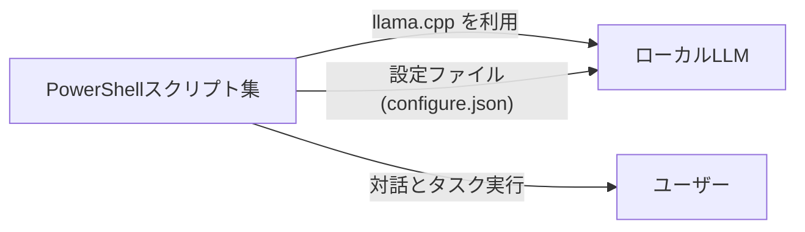
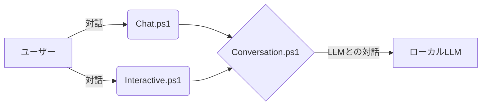
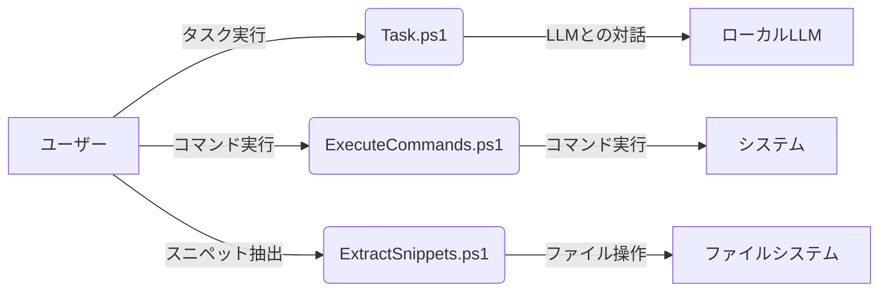
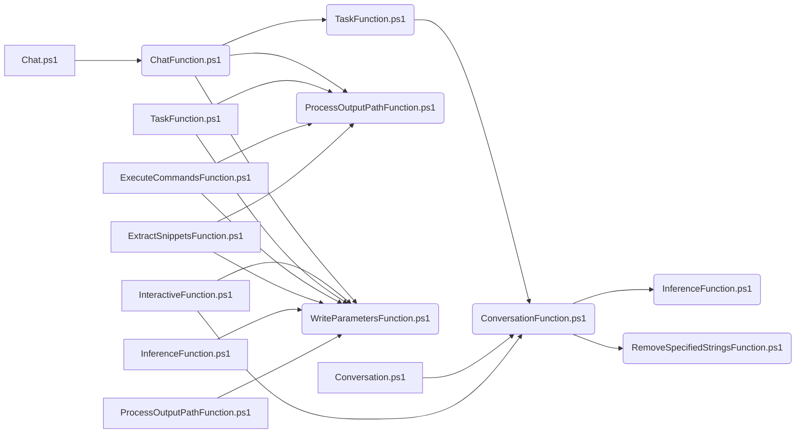
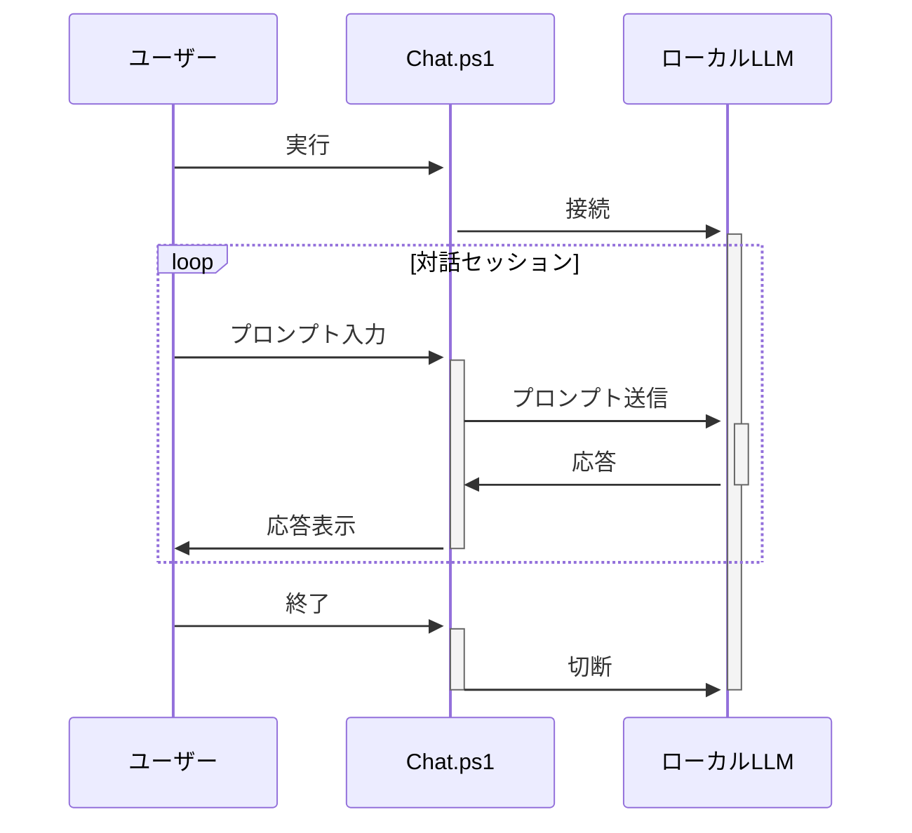
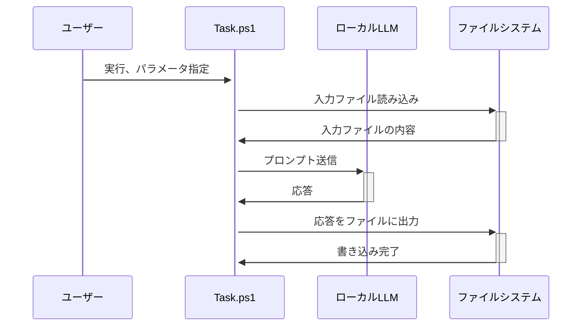

# src_genai_Script_to_use_local_LLM_with_llama.cpp_and_PowerShell
ローカルLLMをllama.cppとPowerShellで利用するスクリプト

このドキュメントでは、ローカルLLMと対話し、タスクを実行するためのPowerShellスクリプト集を紹介します。

<br/><br/>
### 目次

- [概要](#概要)
- [主な機能](#主な機能)
    - [1. ローカルLLMとの対話](#1-ローカルllmとの対話)
    - [2. タスクの実行](#2-タスクの実行)
- [スクリプト呼び出し関係図](#スクリプト呼び出し関係図)
- [スクリプト詳細](#スクリプト詳細)
    - [1. 設定ファイル (configure.json)](#1-設定ファイル-configurejson)
    - [2. Chat.ps1 の使い方](#2-chatps1-の使い方)
    - [3.  Task.ps1 の使い方](#3--taskps1-の使い方)
- [補足](#補足)

<br/><br/>


### 概要

このスクリプト集は、PowerShellを介して対話とタスク実行を可能にします。設定ファイル`configure.json`で動作パラメータ、APIエンドポイント、プロンプトフォーマット等を定義します。
現時点（2024/07）のバージョンだと、llama.cppをLLMアプリケーションとして使用し、Phi-3 mini をローカルLLMとして使用する設定となっています。



<br/><br/>


### 主な機能

#### 1. ローカルLLMとの対話

- **Chat.ps1**: 会話履歴を保持しながら、継続的な対話セッションを提供します。
- **Interactive.ps1**: 簡単な質問やタスク実行など、対話的なLLM利用を可能にします。
- **Conversation.ps1**: システムプロンプト、ユーザー入力、アシスタントプロンプトを含む1回の会話ターンを処理します。



<br/><br/>


#### 2. タスクの実行

- **Task.ps1**: ファイルからプロンプトを読み込み、LLMとの会話を調整し、応答を処理します。
- **ExecuteCommands.ps1**: テキストファイルからコマンドを抽出し、順番に実行します。
- **ExtractSnippets.ps1**: 入力ファイルからコードスニペットを抽出し、別々のファイルに保存します。



<br/><br/>


### スクリプト呼び出し関係図




<br/><br/>


### スクリプト詳細

#### 1. 設定ファイル (configure.json)

- **n_predict**: 生成されるトークンの最大数
- **Uri**: LLMエンドポイントのアドレス
- **ContentType**: リクエストのコンテンツタイプ
- **system_s, system_e, user_s, user_e, assistant_s, assistant_e**: システム、ユーザー、アシスタントのプロンプトの開始と終了を示す区切り文字


<br/><br/>


#### 2. Chat.ps1 の使い方

1. **前提条件**: llama.cpp、PowerShellがインストール済み、設定完了済み
2. **設定ファイル**: `configure.json`を適切に設定
3. **実行**: PowerShellで`Chat.ps1`を実行、必要に応じてパラメータを指定
4. **対話**: プロンプトを入力し、LLMからの応答を確認
5. **会話履歴からの継続的な対話**: 一度途切れた会話の途中から、会話履歴をもとに会話を継続



<br/><br/>


#### 3.  Task.ps1 の使い方

1. **前提条件**: llama.cpp、PowerShellがインストール済み、設定完了済み
2. **設定ファイル**: `configure.json`を適切に設定
3. **入力ファイルの準備**: 過去のプロンプト、応答内容、システムプロンプト、ユーザープロンプト、アシスタントプロンプトを記述したテキストファイルを用意
4. **実行**: PowerShellで`Task.ps1`を実行、`configure.json`のパス、入力ファイルのパス、出力先パスなどのパラメータを指定
5. **応答の確認**: 出力先に保存されたLLMからの応答を確認
6. **バッチ実行**: Task.ps1により、ローカルLLMに対する複数のタスクを連続的に実行することが可能。



<br/><br/>


### 補足

- 各スクリプトの詳細なパラメータやオプションについては、ソースコードを参照してください。
- このドキュメントは、提供されたソースコードに基づいて作成されています。

<br/><br/>

### Chat.ps1をPowershell(pwsh)で使用する例

#### on Windows powershell

```bash
powershell -NoProfile -ExecutionPolicy Bypass  -Command "$VerbosePreference='Continue';$ErrorActionPreference='Stop';" ./Chat.ps1 -configPath './configure.json' -systemPromptPath './systemPrompt.conf' -assistantPromptPath './assistantPrompt.conf' -outputPath './output'
```

<br/><br/>
#### on Windows pwsh

```bash
pwsh -NoProfile -ExecutionPolicy Bypass  -Command "$VerbosePreference='Continue';$ErrorActionPreference='Stop';" ./Chat.ps1 -configPath './configure.json' -systemPromptPath './systemPrompt.conf' -assistantPromptPath './assistantPrompt.conf' -outputPath './output'
```

<br/><br/>
#### on Linux pwsh

```bash
pwsh -NoProfile -ExecutionPolicy Bypass  -Command '$VerbosePreference="Continue";$ErrorActionPreference="Stop";' ./Chat.ps1 -configPath './configure.json' -systemPromptPath './systemPrompt.conf' -assistantPromptPath './assistantPrompt.conf' -outputPath './output'
```


### Chat.ps1をPowershell(pwsh)で使用。一度途切れた会話の途中から、会話履歴をもとに会話を継続させる例。

#### on Windows powershell
previousPromptPath . . . 過去の「outputPath」に出力されたファイルより、「prompt.txt」を指定
previousContentPath . . . 過去の「outputPath」に出力されたファイルより、「content.txt」を指定
（下記の例はサンプルのためスクリプトと同じディレクトリに配置）
<br/><br/>

```bash
powershell -NoProfile -ExecutionPolicy Bypass  -Command "$VerbosePreference='Continue';$ErrorActionPreference='Stop';" ./Chat.ps1 -configPath './configure.json' -previousPromptPath './prompt.txt' -previousContentPath './content.txt' -systemPromptPath './systemPrompt.conf' -assistantPromptPath './assistantPrompt.conf' -outputPath './output'
```


<br/><br/>

